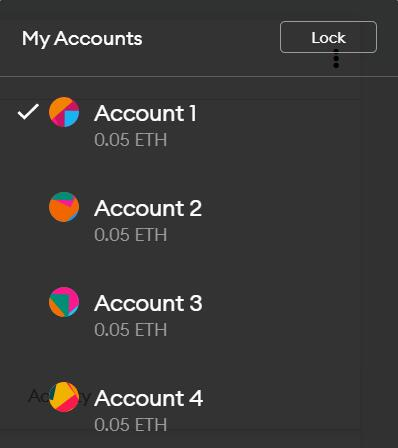
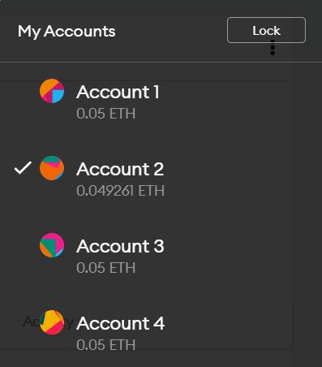
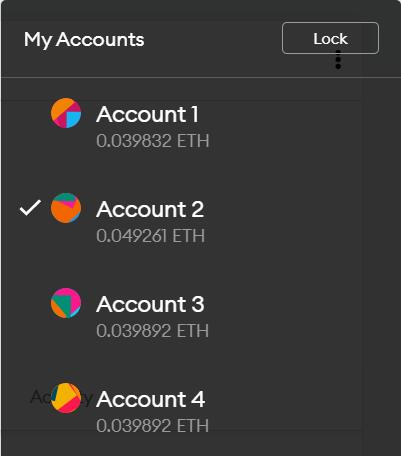
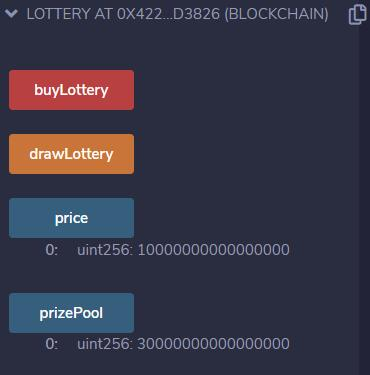
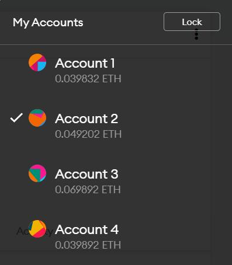
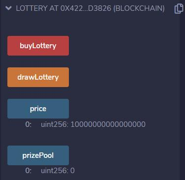

  <strong>Diseño de Infraestructura Inteligente para el IoT</strong>

 

  <strong>Práctica sobre Blockchain 
</strong>

  

<strong>

Jiali Zheng

Jorge Vicente Camuñas Heredia

</strong>

2 / 12 / 2020

## Introducción

En esta práctica se pretende desarrollar el código equivalente a una lotería sobre Blockchain. Para ello se hará uso del IDE Remix y el lenguaje Solidity, en concreto se gastara moneda de prueba de ether.

El funcionamiento del programa será el siguiente:

1. Para empezar al desplegar el programa automáticamente se elegirá al usuario que lo despliegue como administrador de la lotería. Esta persona será la única capaz de poner fin al sorteo.

2. Se añadirán jugadores que deberán pagar el precio del "boleto" para poder apuntarse.

3. Una vez el administrador considere que hay suficientes participantes activará el proceso de fin del sorteo. Con este proceso se elegirá de forma aleatoria a uno de los participantes y se le enviará toda la apuesta acumulada a su cuenta asociada. Tras esto se reiniciará el proceso, manteniendo el mismo administrador, para poder empezar un nuevo sorteo.

En el siguiente apartado se explicará el código adjunto a esta memoria junto con imágenes de la interfaz que aparece para los usuarios que quieran participar en este "smart contract".

## Código

Para empezar se definen cuatro variables globales:

1. "prizePool": la cantidad de moneda jugada por los jugadores, esta variable aumentará cada vez que se una al sorteo un participante. Al pulsar el botón en el menú se muestra la cantidad de moneda acumulada.

  

2. "price": el valor constante de los boletos del sorteo.

  

3. "croupier": es la cuenta que administra la lotería.

4. "players": es el vector donde se guardan los participantes.

Una vez definidas estas variables se pasa al constructor "_price" que establece el precio de los boletos mediante el mensaje enviado por el usuario que despliegue el código. Con esto se deja al usuario que va a administrar la lotería elegir el valor del boleto.

También se crea el modificador "onlyCroupier" que se usará en una función posterior para evitar que alguien haga uso de ella sin ser el elegido como croupier.

Tras todo esto se pasa a definir las diferentes funciones que darán lógica a todo el programa:

1. "buyLottery": esta función "pagable" es la que los usuarios deberán usar para comprar un boleto. Si el precio es correcto se añade al usuario al vector de jugadores y se actualiza el valor de prizePool.

  

Si el precio introducido por el usuario no coincide con el establecido saltará un error con la siguiente información:

  

2. "drawLottery": esta función solo disponible para el croupier pone fin al sorteo. Para ello debe cumplirse que haya, al menos, un participante. Comprobado eso se realiza una transferencia del dinero acumulado a uno de los participantes de forma aleatoria, se reinicia el valor del prizePool y el vector de jugadores a 0.

  

3. "random": esta función permite adaptar la obtención de un valor aleatorio, necesaria para la correcta ejecución de la función anterior.

Como parte final se pide desplegar este programa en la testnet de Ethereum. El proceso se muestra en el siguiente apartado.

## Despliegue en la testnet de Ethereum

Cuando se hizo la prueba en la testnet se observó que no soportaba bien los números reales en el uso de la moneda. Tras investigar en profundidad sobre Solidity, se descubrió que es imposible convertir número enteros a reales. Por tanto, se decidió cambiar la moneda a `wei` y se adaptó el código para ello.

### Prueba
Primer paso para desplegar la aplicación en testnet de Ethereum es instalar `Metamask`, crear 4 cuentas y solicitar ethers para cada cuenta.

  

Segundo paso conectar Metamask con IDE, desplegar la aplicación y pagar la comisión de correspondiente.

  

Tercer paso, con las otras 3 cuentas comprar la lotería por el valor del precio de la lotería + gas para la acción.

  

Depósito(wei) son 0.03 ethers.

  

Cuarto paso, la cuenta 2, que es la cuenta administradora, invoca la función `drawLottery()` para finalizar el sorteo. El resultado es el siguiente: la cuenta 3 ha ganado la lotería y recibe todo dinero que hay en el depósito del contrato.

  

  

